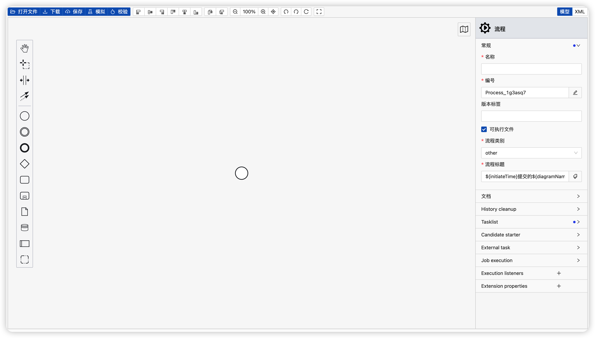
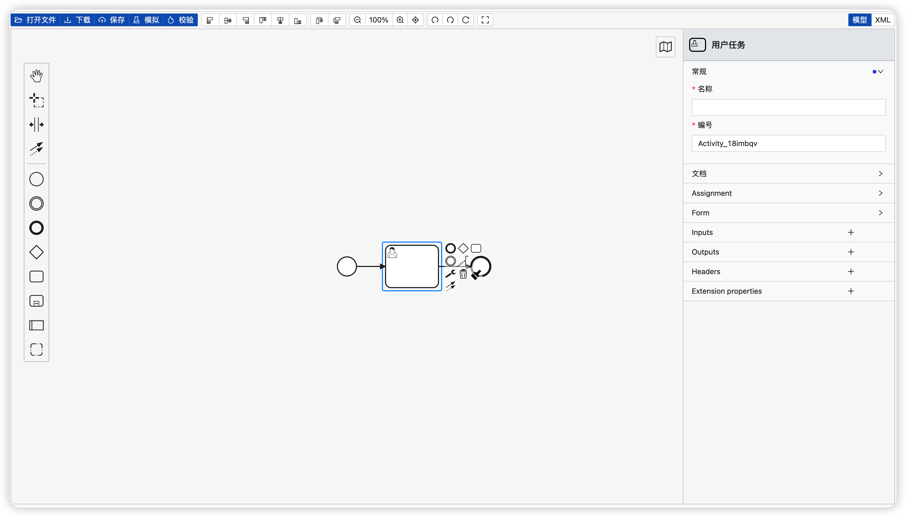
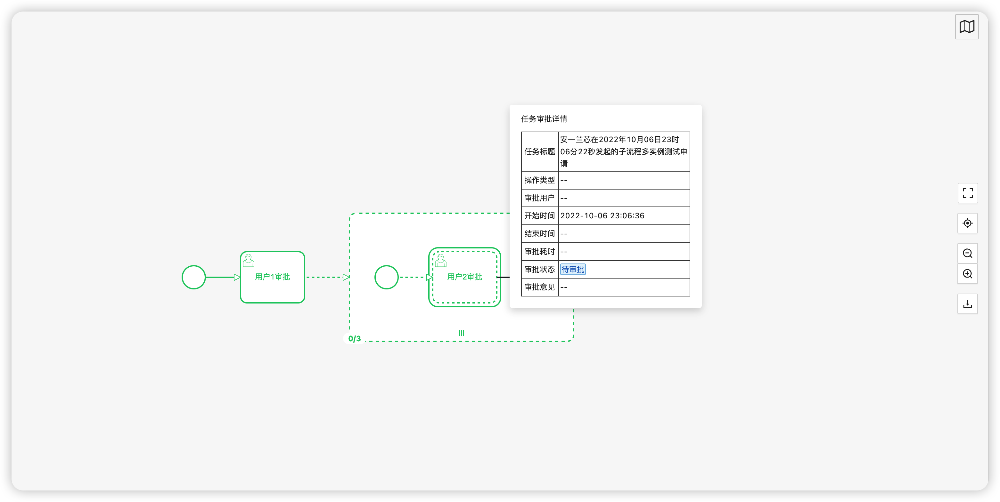
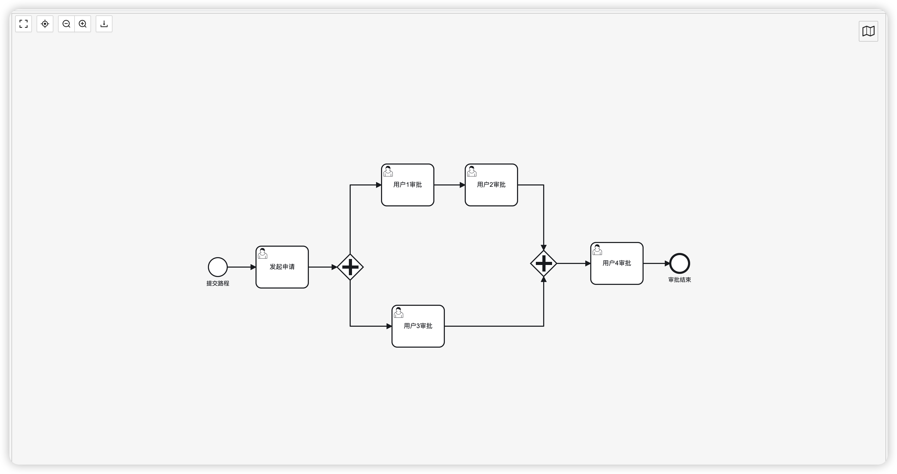
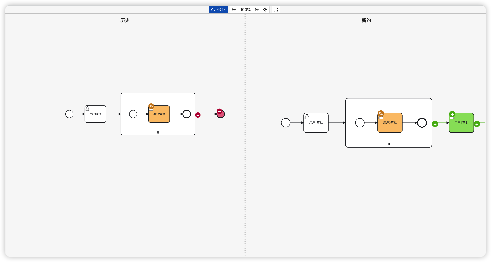

AnYi Process EE Demo
===============
bpmn designer ,bpmn instance ,anyi-process-ee demo

当前最新版本： 2.0.0-beta3（发布日期：2022-12-07）

# 注意事项：
## 一、 安装依赖
```
yarn add anyi-process-ee-antvue
```
## 二、AnYiBpmnDesigner需要引入一下css样式
```
  @import 'anyi-process-ee-antvue/dist/style.css';
  @import 'bpmn-js-color-picker/colors/color-picker.css';
  @import 'bpmn-js/dist/assets/bpmn-font/css/bpmn.css';
  @import 'bpmn-js/dist/assets/bpmn-font/css/bpmn-codes.css';
  @import 'bpmn-js/dist/assets/bpmn-font/css/bpmn-embedded.css';
  @import 'bpmn-js/dist/assets/bpmn-js.css';
  @import 'bpmn-js/dist/assets/diagram-js.css';
  @import 'bpmn-js-properties-panel/dist/assets/properties-panel.css';
  @import 'bpmn-js-token-simulation/assets/css/bpmn-js-token-simulation.css';
  @import 'diagram-js-minimap/assets/diagram-js-minimap.css';
  @import 'bpmn-js-bpmnlint/dist/assets/css/bpmn-js-bpmnlint.css';
```

## 三、AnYiBpmnDiffer需要引入一下css样式
```
  @import 'anyi-process-ee-antvue/dist/style.css';
  @import 'bpmn-js/dist/assets/diagram-js.css';
  @import 'bpmn-js/dist/assets/bpmn-js.css';
```

## 四、AnYiBpmnPreview需要引入一下css样式
```
  @import 'anyi-process-ee-antvue/dist/style.css';
  @import 'bpmn-js/dist/assets/bpmn-font/css/bpmn.css';
  @import 'bpmn-js/dist/assets/bpmn-font/css/bpmn-codes.css';
  @import 'bpmn-js/dist/assets/bpmn-font/css/bpmn-embedded.css';
  @import 'bpmn-js/dist/assets/bpmn-js.css';
  @import 'bpmn-js/dist/assets/diagram-js.css';
  @import 'diagram-js-minimap/assets/diagram-js-minimap.css';

```

## 五、AnYiInstancePreview需要引入一下css样式
```
  @import 'anyi-process-ee-antvue/dist/style.css';
  @import 'bpmn-js/dist/assets/bpmn-font/css/bpmn.css';
  @import 'bpmn-js/dist/assets/bpmn-font/css/bpmn-codes.css';
  @import 'bpmn-js/dist/assets/bpmn-font/css/bpmn-embedded.css';
  @import 'bpmn-js/dist/assets/bpmn-js.css';
  @import 'bpmn-js/dist/assets/diagram-js.css';
  @import 'diagram-js-minimap/assets/diagram-js-minimap.css';
```
## 六、AnYiZeebeBpmnDesigner需要引入一下依赖
```
  @import 'anyi-process-ee-antvue/dist/style.css';
  @import 'bpmn-js-color-picker/colors/color-picker.css';
  @import 'bpmn-js/dist/assets/bpmn-font/css/bpmn.css';
  @import 'bpmn-js/dist/assets/bpmn-font/css/bpmn-codes.css';
  @import 'bpmn-js/dist/assets/bpmn-font/css/bpmn-embedded.css';
  @import 'bpmn-js/dist/assets/bpmn-js.css';
  @import 'bpmn-js/dist/assets/diagram-js.css';
  @import 'bpmn-js-properties-panel/dist/assets/properties-panel.css';
  @import 'bpmn-js-token-simulation/assets/css/bpmn-js-token-simulation.css';
  @import 'diagram-js-minimap/assets/diagram-js-minimap.css';
  @import 'bpmn-js-bpmnlint/dist/assets/css/bpmn-js-bpmnlint.css';
```
# 使用教程
1. camunda c7 建模器预览



1. camunda c8 建模器预览



2. 流程实例预览



3. 流程模型预览



4. 模型比较
   


说明
-----------------------------------

1. yarn install
2. npm run dev

Preview
-----------------------------------
[https://anyilanxin.com](https://anyilanxin.com)
